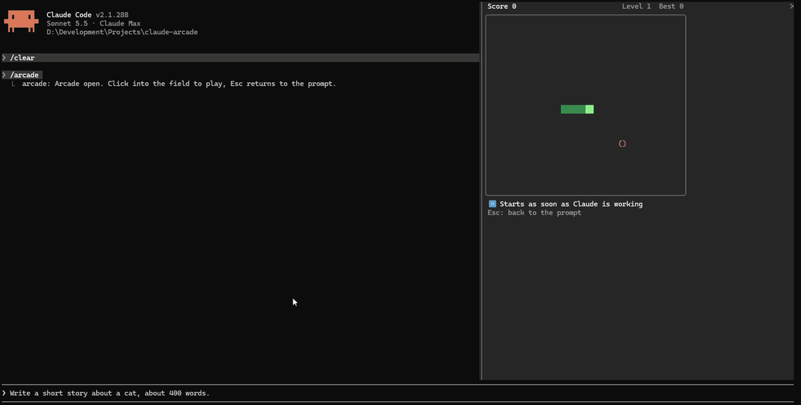

# claude-arcade

[](https://github.com/Zaho92/claude-arcade/actions/workflows/ci.yml)
[](https://github.com/Zaho92/claude-arcade/releases)
[](LICENSE)

Play retro games in a Claude Code pane while Claude works. The game freezes the
moment Claude needs you and picks up again when Claude gets back to work.
Speaks ten languages and follows the one you set for Claude Code.

   

## What it does

| Claude… | The game… |
|---|---|
| starts working on your prompt | runs |
| finishes its turn | freezes: *"Claude is done – your turn"* |
| asks you a question (AskUserQuestion) | freezes until you have answered |
| waits for a permission | freezes until the tool has run (also when one of your own hooks gives the permission) |
| runs a subagent that finishes | keeps running (only the main turn counts) |

The line under the field says why it stands still. Bricks, Worm and Meteors, once
frozen in mid-play for a second or more, wait for `P` when Claude works again: your keyboard may
still be at the prompt. Each game keeps its high
score across sessions, also when you leave a game with `Q` or close the pane
in the middle of one.

## Install

Requires Claude Code **2.1.287 or newer**. The plugin uses the function-hooks
plugin API, which is early access and may change between releases.

From the marketplace in this repo:

```
/plugin marketplace add zaho92/claude-arcade
/plugin install arcade@zaho92-arcade
```

Or from a clone, for one session:

```
git clone https://github.com/zaho92/claude-arcade
claude --plugin-dir ./claude-arcade/plugin
```

## Play

1. Type `/arcade`. A pane opens with the game menu (inline above the prompt,
   or docked beside the transcript in fullscreen mode).
2. Click into the pane so it gets the keyboard, pick a game with `↑`/`↓` and
   `Enter`.

   ```
      ▄▀█ █▀█ █▀▀ ▄▀█ █▀▄ █▀▀
      █▀█ █▀▄ █▄▄ █▀█ █▄▀ ██▄
   ╭───────────────────────────╮
   │ ▶ ██ Bricks      Best 870 │
   │                           │
   │   ██ Worm         Best 31 │
   │                           │
   │      Merge                │
   │                           │
   │   ✱  Mines                │
   │                           │
   │   ●○ Bulls & Cows         │
   │                           │
   │   ♥★ Pairs                │
   ╰───────────────────────────╯
    Clear the wall
    ↑/↓ choose · Enter play · Esc prompt
   ```

3. Give Claude something to do. The game runs as soon as Claude starts.

| Key | |
|---|---|
| `←` `→` `↑` `↓` (or `WASD`, `HJKL`) | move |
| `Space` / `Enter` | the game's main action, restart after game over |
| `F` / `X` | the game's second action (flag a field in Mines) |
| `P` | pause yourself, continue after a pause |
| `Q` / `Backspace` | back to the menu |
| `Esc` | hand the keyboard back to the prompt |

The letter keys also work on a Russian layout. When the game freezes, press
`Esc`, answer Claude, then click back into the pane (and press `P` in Bricks, Worm and Meteors).

It runs in the Claude Code CLI in a terminal. Mobile and VS Code cannot draw
the game region yet and show a note instead.

## Games

| Game | |
|---|---|
| Bricks | Clear the wall with ball and paddle |
| Worm | Eat, grow, never bite yourself; faster every five bites |
| Meteors | Slide your ship along the bottom row and dodge the falling rocks; catch the bonuses, three lives |
| Merge | Slide and merge number tiles up to the gold tile and beyond; turn-based, so a pause never costs anything |
| Mines | Open every safe field, flag the mines; the first field is always safe |
| Bulls & Cows | Crack a four-digit code in ten tries, the old pencil-and-paper game |
| Fifteen | Slide the tiles into order, 1 to 15; the fewer moves, the higher the score; turn-based, so a pause never costs anything |
| Lamps | Switch every lamp off; pressing a lamp flips it and its four neighbours, and fewer presses score more; turn-based |
| Pairs | Find the matching cards in as few tries as you can; bigger boards as the pane allows; turn-based |

## Settings

Under `/plugin` → arcade → configure, or in `settings.json` under
`pluginConfigs.arcade`:

| Setting | Default | |
|---|---|---|
| `language` | `auto` | `auto`, `en`, `de`, `fr`, `es`, `pt`, `it`, `ja`, `zh`, `ko`, `ru` |
| `glyphs` | `auto` | `auto`, `unicode` (block symbols) or `ascii` (plain characters) |
| `sound` | `false` | chime when Claude needs you while the arcade is open (macOS only) |

`language` and `glyphs` are typed in as text. A value the arcade does not
know counts as `auto`.

**Language.** `auto` takes the first of: Claude Code's own `language` setting
(free text such as `"german"` or `"日本語"`), then `LC_ALL`, `LC_MESSAGES`,
`LANG`, then English.

**Glyphs.** Terminals set to Chinese, Japanese or Korean often draw symbols
like `●` or `█` two cells wide, which tears the field apart. `auto` uses
`ascii` for those three languages and `unicode` otherwise.

## What the hooks do

The plugin is a set of hooks: functions Claude Code calls when something
happens in your session. This is all of them, and all they do:

| The hook listens for | To |
|---|---|
| the session starting | pick the language, register `/arcade`, read your high scores |
| `/arcade` being typed | open the pane |
| Claude's turn starting and ending | run and freeze the game |
| a tool call starting and ending, `AskUserQuestion` among them | know when a question or a permission dialog is open, and when it is answered |
| a permission request | freeze the game until the tool it is for has run or was refused |
| the pane being drawn, and a score the pane reports | draw the game, keep the high score |

- **It never answers a permission request.** It only notices that one is
  made, hands it on untouched, and hands the answer back without looking at
  it; allowing or refusing stays with you and your settings. It does not hook
  the permission check itself, and it changes no tool call, no prompt and no
  answer of Claude.
- **It sends nothing anywhere.** No network, no telemetry, no files written.
  What it reads beyond the events above: Claude Code's `language` setting and
  the locale variables `LC_ALL`, `LC_MESSAGES` and `LANG`, to pick a
  language. Of a tool call it keeps the tool's name, the call's id and a short
  checksum of its arguments, in memory, until the call has ended.
- **It stores your high scores, locally.** One number per game, in Claude
  Code's own store for the plugin on your machine. Nothing else is kept
  beyond the session.
- **It plays one local sound, on macOS, if you switch it on.** With `sound`
  set, the file `sounds/pause.wav` that comes with the plugin chimes when the
  game freezes. It is off by default.

## Privacy

- **No personal data, no network.** The arcade collects nothing about you and
  makes no network calls. Nothing leaves your machine.
- **What it reads.** Claude Code's settings, for the `language` set there, and
  the locale variables `LC_ALL`, `LC_MESSAGES` and `LANG`, to pick a language.
- **What it stores.** Your high scores, one number per game, locally in
  Claude Code's own store for the plugin. Nothing else outlasts the session.
- **Your conversation.** It does not read your prompts or Claude's answers.
  It only notices when Claude starts, finishes, asks a question or waits for
  a permission, to pause the game. To tell which tool call a permission is
  for, it keeps the tool's name, the call's id and a short checksum of its
  arguments, in memory, until the call has ended; the arguments themselves
  are not kept.
- **Permissions.** It never answers a permission request.

Questions about any of this: open an
[issue](https://github.com/Zaho92/claude-arcade/issues).

## Contributing

Contributions are very welcome, translations and new games above all.

- **Translations:** the nine languages besides English were translated
  without native review. If yours reads oddly, a one-line pull request to
  `plugin/hooks/i18n.ts` makes a real difference. New languages are welcome too.
- **New games:** a game is one file of pure logic; the arcade handles keys,
  pausing, drawing and high scores. Original games and public-domain classics
  only, no trademarks or look-alikes.
- **Ideas and bugs:** open an issue.

[CONTRIBUTING.md](CONTRIBUTING.md) has the details, and how versions and
releases work. What changed in each version is in
[CHANGELOG.md](CHANGELOG.md); security problems go through
[SECURITY.md](SECURITY.md).

## Develop

```
claude plugin validate .
claude plugin validate plugin
node scripts/test.mjs
```

The plugin itself is the folder `plugin/`; tests, CI and docs stay outside
it, so an installation gets the plugin alone. `scripts/test.mjs` runs
`claude plugin test` with the tests copied in for the run.

- `plugin/hooks/register.tsx`: the hooks module. It registers `/arcade`, opens the
  pane, picks the language and turns Claude's turn events into a pause state.
- `plugin/hooks/arcade.tsx`: the surface module. It runs on the drawing thread and
  draws the menu and the running game.
- `plugin/hooks/host.ts`: the arcade's rules: keys, menu, pause, frame clock.
- `plugin/hooks/games/`: one file per game as pure logic behind `GameDef`
  (`types.ts`), listed in `index.ts`.
- `plugin/hooks/i18n.ts`, `plugin/hooks/glyphs.ts`: texts and characters.
- `plugin/types/index.d.ts`: the plugin's state contract.

A new game is one file in `plugin/hooks/games/` implementing `GameDef`, its texts in
`plugin/hooks/i18n.ts`, an entry in `GAMES` and a test file.

The engine writes the API types to `plugin/.claude-plugin/types/` when it loads the
plugin, and `tsc -p .` type-checks against them, from the repository root.

## Ideas

More games are on the way. Have one in mind? Open an issue.

## About this project

claude-arcade is a hobby project. I am a software developer, but not a
TypeScript developer: the code was written with AI (Claude Code) and reviewed
by me to the best of my knowledge and belief. Expect rough edges, and please
report them.

## Legal

Every game here is either original or based on a public-domain classic, with
its own name and its own look. None of them knowingly uses trademarks,
distinctive designs or assets of other games.

This is an unofficial community project, not affiliated with or endorsed by
Anthropic. Claude and Claude Code are trademarks of Anthropic and are named
here only to say what the plugin works with.

If you believe something in this repository infringes your rights, please get
in touch, by opening an issue or through the contact on my GitHub profile. I
will look into it right away and, when in doubt, take it down. Let's sort it
out directly and quickly.

## License

MIT
